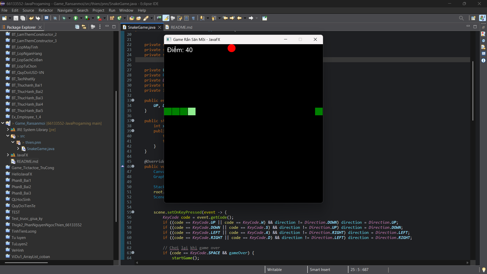
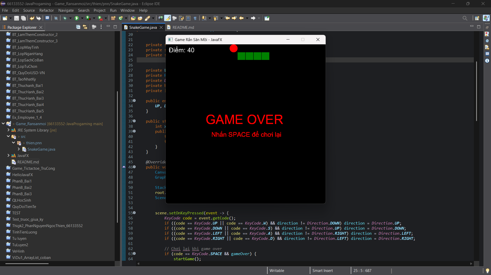

# Bài Tập Cộng Điểm: Game Rắn Săn Mồi (Snake Game - JavaFX)

**Sinh viên thực hiện:** Phan Nguyễn Ngọc Thien  
**Môn học:** Lập trình Java  

## 🎮 Mô tả ứng dụng
Đây là tựa game kinh điển Rắn Săn Mồi (Snake) được phát triển hoàn toàn bằng Java và JavaFX. Khác với các ứng dụng GUI click chuột thông thường, project này minh họa các kỹ thuật lập trình nâng cao trong phát triển Game 2D:
* **Vẽ đồ họa động:** Sử dụng `Canvas` và `GraphicsContext` để render hình ảnh liên tục lên khung hình.
* **Game Loop (Vòng lặp Game):** Áp dụng `Timeline` và `KeyFrame` để kiểm soát tốc độ khung hình (FPS) và trạng thái game theo thời gian thực.
* **Bắt sự kiện (Event Handling):** Lắng nghe sự kiện bàn phím (Keyboard Events) để điều hướng chuyển động bằng các phím Mũi tên hoặc W-A-S-D.
* **Tư duy thuật toán:** Xử lý tọa độ lưới (Grid), logic xuyên tường, logic va chạm (cắn vào đuôi) và cơ chế phát triển mảng động khi rắn ăn mồi.

## 🚀 Công nghệ sử dụng
* Ngôn ngữ: Java (JDK 21)
* Thư viện GUI: JavaFX SDK (Graphics, Animation, Application)
* IDE: Eclipse 

## 📸 Demo kết quả chạy

*(Dưới đây là hình ảnh minh chứng game hoạt động thực tế)*

*Giao diện khi đang chơi và tính điểm*

*Màn hình thông báo Game Over khi va chạm*

## ⚙️ Hướng dẫn chạy chương trình
1. Mở project trong Eclipse.
2. Đảm bảo đã cấu hình **JavaFX SDK** trong thư viện (`Classpath`) và thêm `module-path` ở phần VM Arguments.
3. Chạy file `SnakeGame.java` nằm trong `package thien.pnn`.
4. Sử dụng các phím **Mũi tên** hoặc **W, A, S, D** để di chuyển. Nhấn **SPACE** để chơi lại khi thua.