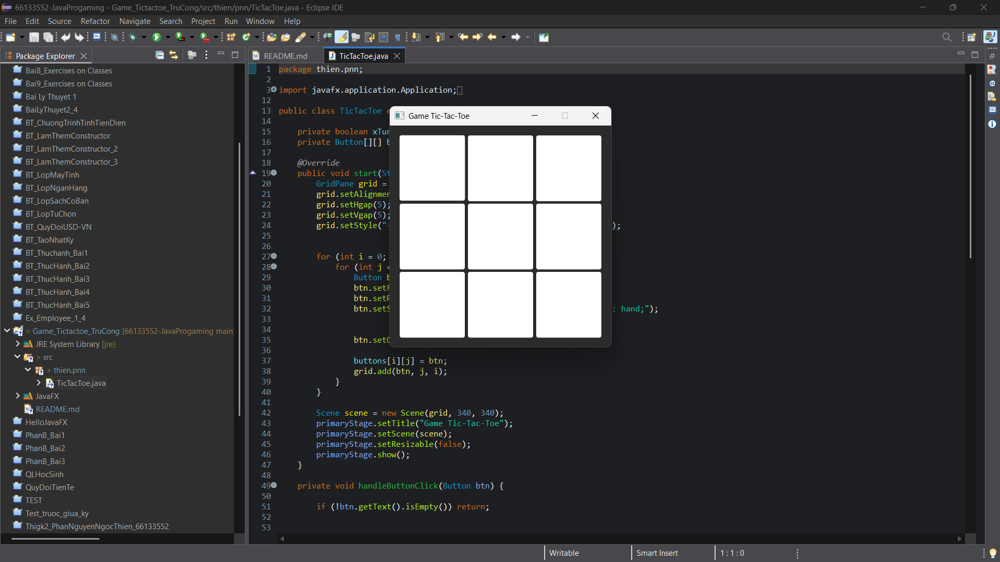
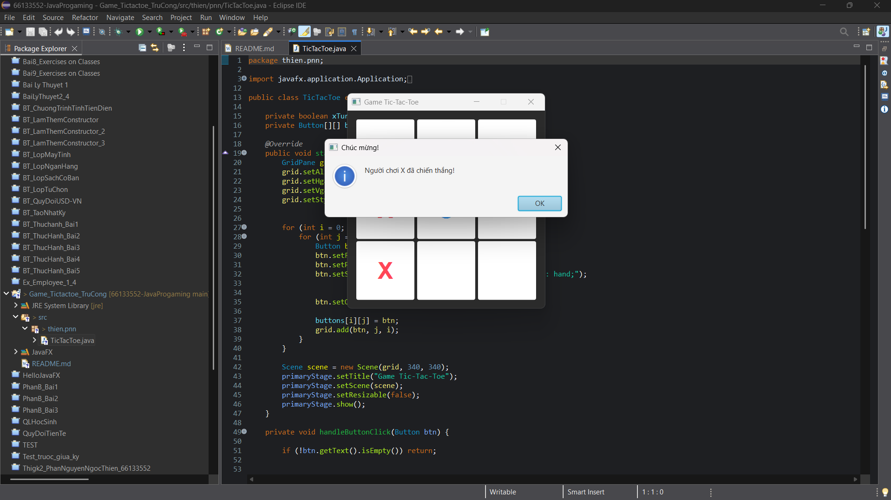

# Bài Tập Cộng Điểm: Game Tic-Tac-Toe (JavaFX)

**Sinh viên thực hiện:** Phan Nguyễn Ngọc Thiện  
**Môn học:** Lập trình Java  

## 🎮 Mô tả ứng dụng
Đây là một ứng dụng game Cờ Caro (Tic-Tac-Toe) cơ bản kích thước 3x3 được xây dựng bằng JavaFX. Ứng dụng thể hiện việc áp dụng các kiến thức về:
* Khởi tạo và quản lý giao diện đồ họa (GUI) với JavaFX (`GridPane`, `Scene`).
* Xử lý sự kiện (Event Handling) qua tương tác người dùng.
* Cấu trúc dữ liệu mảng 2 chiều và tư duy thuật toán kiểm tra logic thắng/thua/hòa.
* Quản lý trạng thái trò chơi (Game State).

## 🚀 Công nghệ sử dụng
* Ngôn ngữ: Java (JDK 21)
* Thư viện GUI: JavaFX SDK
* IDE: Eclipse 

## 📸 Demo kết quả chạy 

*(Dưới đây là hình ảnh minh chứng game hoạt động thực tế)*

## ⚙️ Hướng dẫn chạy chương trình
1. Mở project trong Eclipse.
2. Đảm bảo đã cấu hình **JavaFX SDK** trong thư viện (`Classpath`) và thêm `module-path` ở phần VM Arguments.
3. Chạy file `TicTacToe.java` nằm trong `package thien.pnn`.